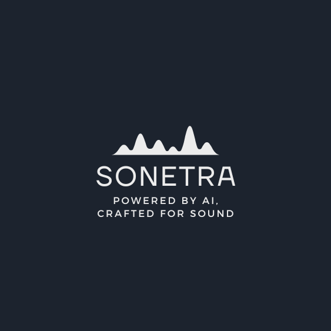

# 🎵 SONETRA - AI Powered Music Platform

  
   
  <em>Powered by AI, Crafted for Sound</em>

  <a href="#vision">Vision</a> •
  <a href="#current-status">Current Status</a> •
  <a href="#roadmap">Roadmap</a> •
  <a href="#contributing">Contributing</a> •
  <a href="#support">Support Us</a>

## 🚀 Vision

SONETRA aims to revolutionize music production by making professional-grade AI-powered audio tools accessible to everyone. Our platform will bridge the gap between amateur creators and professional studios through cutting-edge artificial intelligence and signal processing.

### 🎯 Planned Features

- **🎼 Intelligent Beat Detection**
  - Ultra-precise beat tracking using hybrid ML models
  - Real-time tempo analysis and adjustment
  - Advanced phase alignment detection

- **🎹 Smart Key Detection**
  - Professional-grade key and scale analysis
  - Harmonic compatibility checking
  - Circle of fifths navigation

- **🎛 AI-Powered Style Transfer**
  - Transform genres while preserving musical integrity
  - Advanced style preservation technology
  - Multiple style presets (Electronic, Rock, Jazz, etc.)

- **🔄 Seamless Transitions**
  - Automatic beat-matched transitions
  - Harmonic mixing assistance
  - Energy-aware crossfading

## 🏗 Current Status

> **Note: This project is currently under active development and is not yet ready for production use.**
> **Last Updated: January 2025 - Active Development**

We have completed:
- ✅ Core architecture design
- ✅ Basic beat detection algorithm
- ✅ Initial frontend interface
- ✅ Basic API structure

Currently working on:
- 🔨 Advanced beat detection improvements
- 🔨 Key detection implementation
- 🔨 Frontend user experience
- 🔨 API optimization

## 🤝 We Need Your Help!

SONETRA is more than just a project - it's a movement to democratize AI-powered music production. In this era of rapid AI advancement, we believe in the power of community-driven innovation. We're building something revolutionary, and we need passionate people like you to make it happen.

> "The AI revolution in music should be accessible to everyone, not just big studios. Let's build this future together!"

We're actively seeking collaborators and contributors in:

- 🧠 Machine Learning / Deep Learning
- 🎵 Digital Signal Processing
- 🎨 Frontend Development (React/TypeScript)
- ⚡ Backend Development (Python/FastAPI)
- 🎼 Music Theory
- 📊 Data Science

## 💡 Why Contribute?

The AI revolution is happening now, and music technology is at its forefront. By contributing to SONETRA, you'll:

- Work with cutting-edge AI and audio processing technologies
- Join a growing community of music tech enthusiasts
- Shape the future of music production
- Gain experience with modern tech stack
- Open source contribution opportunities
- Be part of a revolutionary movement in music technology
- Work with cutting-edge AI and audio processing technologies
- Join a vibrant community of forward-thinking creators
- Shape the democratization of music production
- Gain hands-on experience with state-of-the-art tech
- Build something that thousands of musicians will use
- Learn from and collaborate with experts in AI, DSP, and music

## 📊 Development Roadmap

### Phase 1 (Current)
- [ ] Core beat detection engine
- [ ] Basic web interface
- [ ] API foundation
- [ ] Initial testing framework

### Phase 2 (Q2 2025)
- [ ] Key detection implementation
- [ ] Style transfer prototype
- [ ] User authentication
- [ ] Basic cloud infrastructure

### Phase 3 (Q3 2025)
- [ ] Advanced style transfer
- [ ] Real-time processing
- [ ] Mobile app development
- [ ] Community features

### Phase 4 (Q4 2025)
- [ ] Advanced AI model improvements
- [ ] Cross-platform integration
- [ ] Professional studio features
- [ ] Enterprise solutions

## 🛠 Technical Stack

- **Frontend**: React, TypeScript, Material UI
- **Backend**: Python, FastAPI, AsyncIO
- **AI/ML**: PyTorch, librosa, numpy
- **Infrastructure**: Docker, Redis, PostgreSQL

## 🤝 How to Contribute

We welcome contributions of all kinds! Here's how you can help:

1. 👩‍💻 Code contributions
2. 🎵 Test audio samples
3. 📝 Documentation
4. 🐛 Bug reports
5. 💡 Feature suggestions
6. 🎨 UI/UX design

See our [Contributing Guide](CONTRIBUTING.md) for more details.

## 🌟 Support Us

The future of music production is being built right now, and everyone can contribute. Whether you're a developer, musician, or enthusiast, there's a place for you in our community. Here's how you can be part of this revolution:

- ⭐ Star and watch this repository to show your support
- 🔄 Spread the word about SONETRA
- 🎵 Test our algorithms with your music
- 🐛 Report bugs and suggest features
- 📝 Help improve our documentation
- 🌍 Help with translations
- 🎨 Contribute to UI/UX design
- 💡 Share your ideas and feedback

> "Great achievements are born from great collaborations. Join us in revolutionizing music production with AI!"

## 📫 Contact & Community

Join our vibrant community of innovators, creators, and music enthusiasts:

- 📧 Email: cryonicx@protonmail.com
- 💬 Telegram: [@cryonicx](https://t.me/cryonicx)

We have regular community calls, hackathons, and collaborative sessions. Everyone is welcome!

## 📄 License

MIT License - see [LICENSE](LICENSE) for details

---

  Together, we're building the future of music production. Your contribution could be the key to the next breakthrough! 🚀

